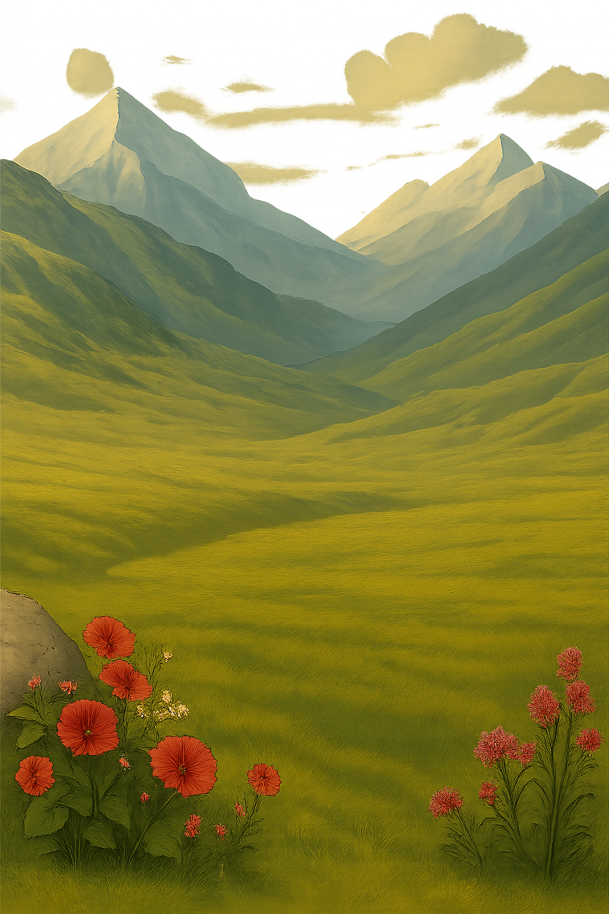
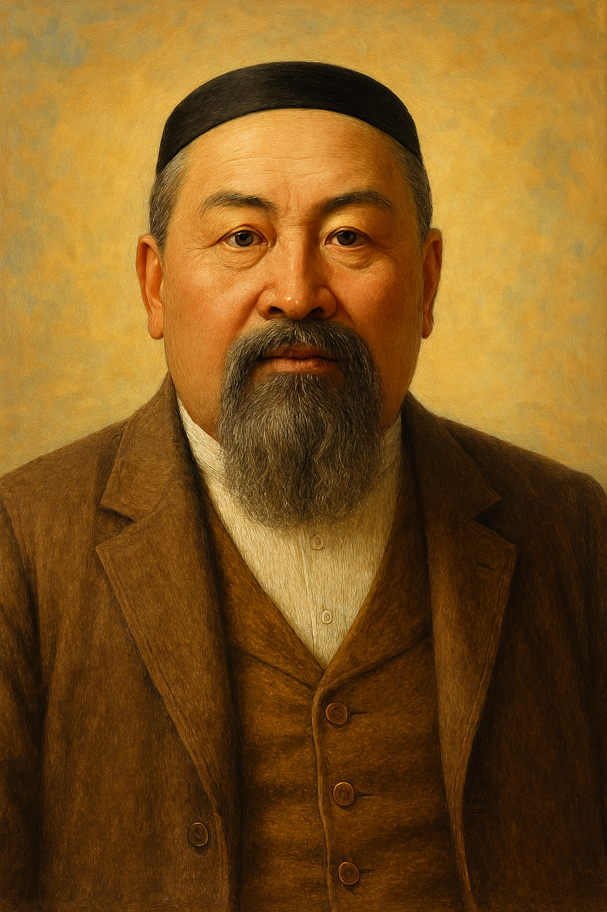
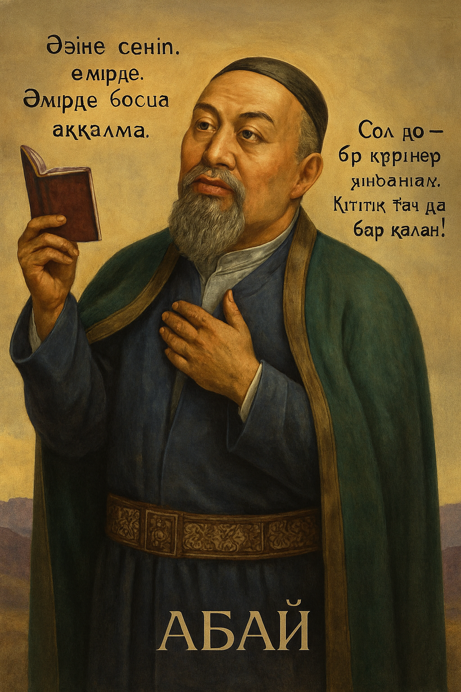

<html lang="kk">
<head>
    <meta charset="UTF-8">
    <meta name="viewport" content="width=device-width, initial-scale=1.0">
    <title>Абайдың "Толық Адам" ілімі</title>
    
</head>
<body>
    

        <!-- 1-бет -->
        

            
            

                
                <h1 class="slide-title">Абайдың «Толық адам» ілімі</h1>
                

                    
Ұлттық білім беру негізі

                

                
1

            

        

        
        <!-- 2-бет -->
        

            
            

                <h1 class="slide-title">«Толық адам» ілімін тану </h1>
                

                    
Біреуінің күні жоқ біреуінсіз, 
                    Ғылым сол үшеуінің жөнін білмек.

                    
                    
FAЛAM-AДAM тандемі: Ceзiну 
                    Maxa66атпен әрекет ету

                    
                    

                        

                            
ЖҮРЕК 
                            AқИҚАТ: тану 
                            Көкірек көзін ашу

                        

                        

                            
АҚЫЛ 
                            ҚАЙPAT 
                            KУАТТЫ жұмсау 
                            «Ұттым-Ұттымға» сүйену

                        

                    

                

                
2

            

        

        
        <!-- 3-бет -->
        

            
            

                <h1 class="slide-title">«Толық адам» ІЛІМІНІҢ кілті</h1>
                

                    
ғажайып ақылды және ғажайыппен жасаған денеге кіргізіп, мұнша салихат иесі қылғаны хикметпенен сұлтан қылғандығы емес пе?

                    
                    
(27-сөз)

                    
                    
Біреуі ойын біреуіне ұқтырарлық тіліне сез беріп жаратпағы махаббат емес пе?

                    
                    
Махаббаттың төлеуі - махаббат. Талап, ұғым махаббаттан шығады (38-сөз).

                

                
3

            

        

        
        <!-- 4-бет -->
        

            
            

                <h1 class="slide-title">Адамдық деңгейлері</h1>
                

                    
НАДАН: 
                    Өзінде ой жоқ, 
                    Басында ми жоқ, 
                    Күлкішіп кердең наданның. 
                    Көп айтса көнді, 
                    Жұрт айтса болды - 
                    Әдеті надан адамның.

                    
                    
АДАМ: 
                    Қашан бір бала ғылым, білімді көксерлік болса, сонда ғана оның аты АДАМ болады

                    
                    
ТОЛЫҚ АДАМ: 
                    Құдай Тағала жолында жүруді өзіне кім шарт қылып қадам басса, сол ТОЛЫҚ АДАМ болады (38)

                

                
4

            

        

        
        <!-- 5-бет -->
        

            
            

                <h1 class="slide-title">АДАМДЫҚ ТАЛАБЫ</h1>
                

                    
*Ғылым таппай мақтанба, 
                    *Орын таппай баптанба, 
                    *Құмарланып шаттанба, 
                    *Ойнап босқа күлуге...

                    
                    
«Біз ғылымды жасап шығара алмаймыз, жаралып, жасалып қойған нөрселерді сезбекпіз, көзбен көріп, ақылмен біліп...»

                

                
5

            

        

        
        <!-- 6-бет -->
        

            
            

                <h1 class="slide-title">Адам болудың баспалдағы</h1>
                

                    
Адамзатқа не керек:

                    
* Сүймек, 
                    * Сезбек, 
                    * Кейімек, 
                    * Харекет қылмақ, 
                    * Жүгірмек, 
                    * Ақылмен ойлап сөйлемек.

                

                
6

            

        

        
        <!-- 7-бет -->
        

            
            

                <h1 class="slide-title">«Толық адам» іліміне бастайтын сүрлеу</h1>
                

                    
Уайым 
                    қайғысыздығыңа  уайым-қайғы  қылдағы, сол уайым-қайғысыздықтан  құтыларлық орынды харекет  табу керек hәм қылу керек (4)

                

                
7

            

        

        
        <!-- 8-бет -->
        

            
            

                <h1 class="slide-title">Адам болам десеңіз... (шарты)</h1>
                

                    

                        РАҚЫМ 
                        ҚАНАҒАТ 
                        ТЕРЕҢ ОЙ 
                        ЕҢБЕК 
                        ТАЛАП
                    

                

                
8

            

        

        
        <!-- 9-бет -->
        

            
            

                <h1 class="slide-title">Пендеге тән куаныш пен жұбаныш</h1>
                

                    
«... Оның қасында біз сәулелі кісінің бірі емеспіз бе? Оған қарағанда мен таза кісі емеспін бе?»

                    
                    
«Жалғыз біз бе, елдің бөрі де сүйтіп-ақ жүр ғой, көппен керген үлы той, көппен бірге болсақ болады да...» (23-сөз)

                

                
9

            

        

        
        <!-- 10-бет -->
        

            
            

                <h1 class="slide-title">ЖАЛҚАУЛЫҚ - АДАМ ДҰШПАНЫ</h1>
                

                    
Әрбір жалқау кісі қорқақ, қайратсыз тартады; 
                    әрбір қайратсыз қорқақ, мақтаншақ келеді; 
                    әрбір мақтаншақ қорқақ, ақылсыз, надан келеді; 
                    әрбір ақылсыз надан, арсыз келеді; 
                    әрбір арсыз жалқаудан сұрамсақ, өзі тойымсыз, өнерсіз, ешкімге достығы жоқ жандар шығады (3- сөз).

                    
                    
Қулық саумақ, көз сүзіп, тіленіп, адам саумақ - өнерсіз иттің ісі (4-сөз) 
                    - Тоқ тіленші - адамның сайтаны

                

                
10

            

        

        
        <!-- 11-бет -->
        

            
            

                <h1 class="slide-title">ЖҮРЕК- ИМАН ҰЯСЫ</h1>
                

                    
Tipi адамның жүректен аяулы жері бола ма? Тіл жүректің айтқанына көнсе, жалған шықпайды. Амалдың тілін алса, жүрек ұмыт қалады.

                    
                    
Махаббатсыз дүние бос, Хайуанға оны қосындар

                

                
11

            

        

        
        <!-- 12-бет -->
        

            
            

                <h1 class="slide-title">ЫСТЫҚ ҚАЙРАТ - ҚУАТ КӨЗІ</h1>
                

                    
Алла тағала саған еңбек қылып мал табарлық куат берді... Сол куатты жұмсарлық ғылым берді... Ол ғылымды ұғарлық ақыл берді... Ерінбей еңбек қыл...

                    
                    
... көштің соңынан итше ере бермей, адасқан көптен атының басын бұрып алуға жараған, әділетті ақыл мойындаған нөрсете, қиын да болса, мойындау, әділетті ақыл мойындамаған нөрсете, юңай да болса, мойындамау - ерлік (14)

                

                
12

            

        

        
        <!-- 13-бет -->
        

            
            

                <h1 class="slide-title">Толық Адам: Қабілеттің Қасиетке ұласуы</h1>
                

                    <table class="table">
                        <tr>
                            <th></th>
                            <th>Қабілет</th>
                            <th>Қабілет</th>
                        </tr>
                        <tr>
                            <td><strong>Сөйлеу</strong></td>
                            <td>↓</td>
                            <td><strong>Ойлау</strong></td>
                        </tr>
                        <tr>
                            <td><strong>Қасиет:</strong></td>
                            <td></td>
                            <td><strong>Қасиет:</strong></td>
                        </tr>
                        <tr>
                            <td><strong>Шешендік</strong></td>
                            <td>↓</td>
                            <td><strong>Даналық</strong></td>
                        </tr>
                        <tr>
                            <td colspan="3" style="padding: 20px;">
                                
Адамның қабілеті мен қасиетінің үйлесімі - толық адам болудың негізі

                            </td>
                        </tr>
                    </table>
                

                
13

            

        

        
        <!-- 14-бет -->
        

            
            

                <h1 class="slide-title">Толық АДАМ табиғаты</h1>
                

                    
3 тану: Алла ғағаланы танымақтық, өзін танымақтық, дүниені танымақтық (38)

                    
                    
Мал, мақтан, ғиззат-құрмет адамды өзі іздеп тапса, адамдықты бұзбайды hәм көрік болады. Егерде адам өзі оларға табынып іздесе, тапса да, таппаса да адамдығы жоғалады (38)

                    
                    
Биік мансап - биік жартас, ерінбей еңбектеп жылан да шығады, екпіндеп ұшып қыран да шығады (37)

                

                
14

            

        

        
        <!-- 15-бет -->
        

            
            

                <h1 class="slide-title">ТОЛЫҚ АДАМ болмысы:</h1>
                

                    
Ақиқатты тану (рациональны меже); 
                    ақиқаттың сырын сезіну (эмоциональны күй); 
                    жасампаздық (адами әлеует); 
                    көркем мінез (кісілік қалып) ҮЙЛЕСІМІ.

                

                
15

            

        

        
        <!-- 16-бет -->
        

            
            

                <h1 class="slide-title">ТОЛЬІҚ АДАМ бітімі</h1>
                

                    
Тән куаты: 
                    жибили (ішу, жеу, ұйықтау + 5 сезім мүшесі арқылы білуге ұмтылу);

                    
                    
Жан қуаты: 
                    кәсиби (жибилиден басталып, кейін сақтау арқылы зораятын дағдылар) + 3 артық қуат (түрткі, «тыншытпайтын» күш, жүректің сезімталдығы)

                    
                    

                        

                            
Тән куатының нәтижесі: 
                            Дәулет, Еркіндік, Тәуелсіздік

                            
                            
Тән куатының сипаты: 
                            Сырттан тауып, сыртта сақталады

                        

                        

                            
Жан куатының нәтижесі: 
                            Ақыл, Ғылым, Махаббат

                            
                            
Жан куатының сипаты: 
                            ІШКІ Рухани әлемді жетілдіреді

                        

                    

                

                
16

            

        

        
        <!-- 17-бет -->
        

            
            

                
                <h1 class="slide-title">Назарларыңызға рахмет</h1>
                

                    
Абай Құнанбаевтың "Толық Адам" ілімі бойынша презентация

                

                
17

            

        

    

    
    

        <button class="nav-btn" id="prevBtn">← </button>
        <button class="nav-btn" id="nextBtn"> →</button>
    

    
    
</body>
</html>
